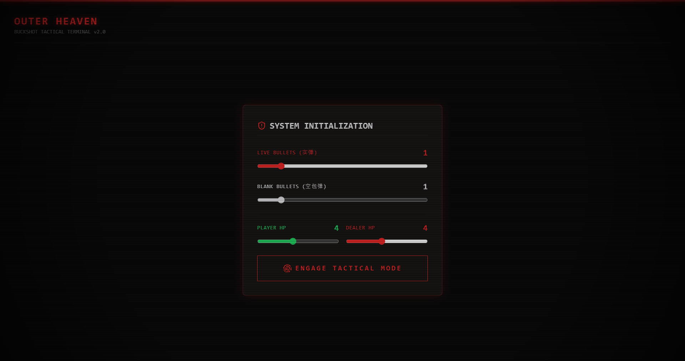
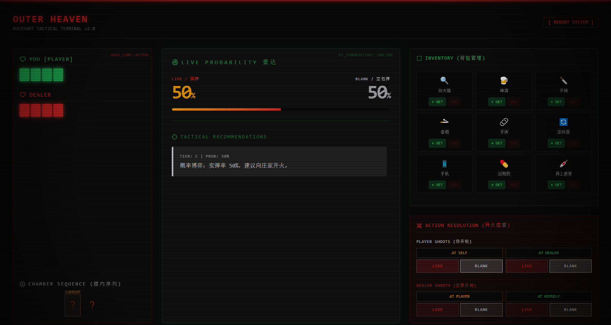

<div align="center">
  
  <h1>Buckshot Roulette Tactical Terminal</h1>
  <p><strong>An advanced tactical assistant and card counter for Buckshot Roulette.</strong></p>
  <p>Don't leave your life to chance. Let the logic calculate the odds.</p>

  [](https://opensource.org/licenses/MIT)
  [](https://wails.io)
  [](https://react.dev)

  [**🇨🇳 简体中文说明**](./README_zh.md)
</div>

---

## ☢️ Overview

**Buckshot Roulette Tactical Terminal** is a cross-platform desktop application designed to give you the ultimate edge in *Buckshot Roulette*. Built with a dark, wasteland-style CRT terminal interface, it not only tracks the state of the gun but also uses a heuristically evaluated decision tree to recommend the absolute best course of action at any given moment.

> *Never guess again. Know your odds, track your items, and secure the kill.*

---

## ✨ Core Features

* **Real-time Probability Radar**: Instantly calculates the exact probability of the next shot being LIVE (🔴) or BLANK (⚪) based on the remaining unknown bullets.
* **Decision Assist Engine**: Provides tiered tactical advice (S/A/B/C):
  * **[S-Tier] Absolute Kill**: Recommends lethal combos (e.g., Inverter + Handsaw) when lethal damage is guaranteed.
  * **[A-Tier] High Value**: Recommends using Cigarettes or taking a safe shot at yourself for an extra turn.
  * **[B-Tier] Information Gathering**: Suggests using the Magnifying Glass, Burner Phone, or Adrenaline when blind.
  * **[C-Tier] Probabilistic Gambles**: Guides you on when to use Handcuffs and shoot the dealer based on percentage odds.
* **Item Inventory Tracking**: Keep track of all your items and the dealer's state (Handcuffed, Sawed barrel).
* **Smart Round Management**: Automatically inherits surviving HP from the previous round when reloading a new magazine.
* **Immersive UI**: Fully responsive, dark-mode terminal aesthetic complete with CRT scanlines and vignette effects.

---

## 📸 Screenshots





---

## 🛠️ Installation & Download

We provide pre-built executables for **Windows**.

1. Go to the [**Releases**](https://github.com/Pi3-l22/Buckshot-Roulette-tactical-terminal/releases) page.
2. Download the latest version (`buckshot-tactical-terminal-windows-amd64.exe`).
3. Run the application directly. No installation required!

> **Note for macOS and Linux users**: Automated builds for macOS and Linux have been removed. If you are on these platforms, you will need to build the application from source. Please refer to the **Building from Source** section below.

---

## 💻 Tech Stack

- **Backend / Desktop Frame**: [Wails v2](https://wails.io/) (Go) - Lightweight, blazing fast, and tiny executable size.
- **Frontend**: React 19 + TypeScript + Vite.
- **State Management**: Zustand.
- **Styling**: Tailwind CSS v4 + Lucide React (Icons).

---

## 🚀 Building from Source

If you want to modify the code, or if you need to build the executable for **macOS or Linux**:

### Prerequisites
- [Go 1.23+](https://go.dev/dl/)
- [Node.js 20+](https://nodejs.org/en/)
- [Wails CLI](https://wails.io/docs/gettingstarted/installation) (`go install github.com/wailsapp/wails/v2/cmd/wails@latest`)

> **For Linux users:** You will also need standard build dependencies. (e.g., on Ubuntu: `sudo apt install libgtk-3-dev libwebkit2gtk-4.1-dev build-essential pkg-config libnspr4-dev libnss3-dev libglib2.0-dev`).
> 
> **For macOS users:** You will need Xcode Command Line Tools (`xcode-select --install`).

### Steps
1. Clone the repository:
   ```bash
   git clone https://github.com/Pi3-l22/Buckshot-Roulette-tactical-terminal.git
   cd Buckshot-Roulette-tactical-terminal
   ```
2. Start the development server (hot-reload):
   ```bash
   wails dev
   ```
3. Build the standalone executable:
   ```bash
   wails build
   ```
   The output file will be located in the `build/bin` directory.

---

## 🤝 Contributing

Pull requests are welcome! If you have ideas for better decision strategies, new UI themes, or bug fixes:
1. Fork the repo.
2. Create your feature branch (`git checkout -b feature/AmazingFeature`).
3. Commit your changes (`git commit -m 'Add some AmazingFeature'`).
4. Push to the branch (`git push origin feature/AmazingFeature`).
5. Open a Pull Request.

## 📄 License

Distributed under the MIT License. See `LICENSE` for more information.