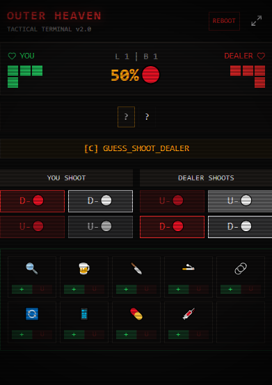

<div align="center">
  
  <h1>Buckshot Roulette 战术终端</h1>
  <p><strong>《恶魔轮盘 (Buckshot Roulette)》进阶辅助决策工具及记牌器</strong></p>
  <p>别把命交给运气，让逻辑算法帮你算尽底牌。</p>

  [](https://opensource.org/licenses/MIT)
  [](https://wails.io)
  [](https://react.dev)

  [**🇺🇸 English README**](./README.md)
</div>

---

## ☢️ 概览

**Buckshot Roulette 战术终端** 是一个轻量级、跨平台的桌面应用程序，旨在让你在《恶魔轮盘》这款游戏中获得绝对的博弈优势。
程序采用了游戏原汁原味的废土风格、暗黑 CRT 终端 UI 界面，除了充当**完美的记牌器**之外，它内置的启发式辅助算法还能为你提供实时最优的**战术决策指导**。

> *不再靠蒙，用数学和逻辑终结庄家！*

---

## ✨ 核心功能

* **实时概率雷达**：基于当前剩余的子弹，动态计算下一发为 实弹 (🔴) 还是 空包弹 (⚪) 的精准百分比概率。
* **进阶版辅助决策引擎**：根据你和庄家的血量、子弹序列概率、甚至你背包里的道具，提供 S/A/B/C 四个评级的操作建议：
  * **[S级] 绝对斩杀**：检测到斩杀线时，提示必杀连招（例如使用 放大镜+逆转器+手锯 直接带走庄家）。
  * **[A级] 绝对收益**：在确定信息的情况下推荐最佳动作（如确认为空弹时打自己白嫖回合，或者优先吃烟回血）。
  * **[B级] 探测与控场**：在信息不足时推荐使用 手机、放大镜 等道具。
  * **[C级] 概率博弈**：根据概率指导你在没有任何信息时的“赌命”开枪方向。
* **全要素道具背包**：支持记录所有加倍模式的道具（香烟、过期药、肾上腺素、手铐、手锯、逆转器、手机等），所有道具效果都能在状态机中联动结算。
* **智能回合继承**：当子弹打空时进入装填阶段，自动继承你和庄家的剩余真实血量，省去重新手调的麻烦。
* **迷你置顶模式**：支持一键将窗口缩小为置顶的“迷你状态机”，完美伴随游戏全屏运行，既不遮挡画面又能保留所有计算和标记功能。
* **沉浸式 UI**：完整的响应式布局，带微恐怖氛围的 CRT 扫描线和暗角特效。

---

## 📸 界面预览




---

## 🛠️ 安装与下载体验

工具无需繁琐配置，双击即开即用！目前我们仅提供 **Windows** 的预编译版本。

1. 前往本仓库的 [**Releases (发布页面)**](https://github.com/Pi3-l22/Buckshot-Roulette-tactical-terminal/releases)。
2. 下载最新的 Windows 应用程序（`buckshot-tactical-terminal-windows-amd64.exe`）。
3. 运行即可开启你的辅助大脑。

---

## 💻 技术栈

- **桌面外壳 (底层)**：[Wails v2](https://wails.io/) (Go 语言) - 替代 Electron，启动极快，内存占用和打包体积（仅十余兆）极小。
- **前端视图**：React 19 + TypeScript + Vite。
- **状态管理**：Zustand - 轻量优雅维护游戏内复杂的状态机。
- **视觉构建**：Tailwind CSS v4 + Lucide React (极简图标)。

---

## 🚀 本地构建说明 (针对 Linux / macOS 或二次开发)

如果你是一名词猿，想要修改决策逻辑，或者你需要为 **macOS 和 Linux** 编译该应用：

### 环境准备
- [Go 1.23+](https://go.dev/dl/)
- [Node.js 20+](https://nodejs.org/en/)
- Wails 命令行工具 (`go install github.com/wailsapp/wails/v2/cmd/wails@latest`)

### 操作步骤
1. 克隆代码：
   ```bash
   git clone https://github.com/Pi3-l22/Buckshot-Roulette-tactical-terminal.git
   cd Buckshot-Roulette-tactical-terminal
   ```
2. 启动热更新开发环境：
   ```bash
   wails dev
   ```
3. 构建跨平台 `.exe` / `.app`：
   ```bash
   wails build
   ```
   构建好的程序会自动出现在 `build/bin/` 目录下。

---

## 🤝 贡献与参与

欢迎提供任何改进意见！不管你是想优化界面、提升决策算法的胜率、或者修复 bug，欢迎提交 Pull Request (PR)。

1. Fork 本仓库。
2. 创建新分支 (`git checkout -b feature/better-logic`)。
3. 提交代码 (`git commit -m 'feat: improve logic accuracy'`)。
4. 推送分支 (`git push origin feature/better-logic`)。
5. 提交 PR。

## 📄 开源协议

本项目采用 MIT License 开源协议 - 详情请查看 `LICENSE`。